<div align="center">



# ⚡ Awesome Accounts Payable Automation (AP)

[](https://github.com/ishandutta2007/Awesome-Awesome-Awesome)<a href="https://discord.gg/jc4xtF58Ve"></a>
[](https://github.com/ishandutta2007/Awesome-Accounts-Payable-Automation/stargazers)
[](https://github.com/ishandutta2007/Awesome-Accounts-Payable-Automation/network/members)
[](LICENSE)
[](https://github.com/ishandutta2007/Awesome-Accounts-Payable-Automation/commits/main)
<a href="https://github.com/ishandutta2007"></a>

<p align="center">
  <strong>A comprehensive, SEO-optimized curated directory of enterprise SaaS platforms, AI OCR extraction engines, 3-way matching systems, and open-source GitHub projects for Accounts Payable (AP) Automation and Spend Management.</strong>
</p>

---

</div>

## 📑 Table of Contents

- [🌟 Overview & Core Architecture](#-overview--core-architecture)
- [🏢 SaaS & Hosted AP Automation Platforms](#-saas--hosted-ap-automation-platforms)
- [💻 Open-Source GitHub Projects](#-open-source-github-projects)
- [🛠️ Architectural Building Blocks & Frameworks](#️-architectural-building-blocks--frameworks)
- [🤝 How to Contribute](#-how-to-contribute)
- [📈 Star History](#-star-history)
- [⚠️ Disclaimer](#️-disclaimer)

---

## 🌟 Overview & Core Architecture

**Accounts Payable (AP) Automation** accelerates the entire **procure-to-pay (P2P)** lifecycle by eliminating manual data entry, streamlining invoice capture, enforcing multi-level approval hierarchies, executing automated 2-way and 3-way matching, and synchronizing transactions directly with modern ERPs and accounting ledgers.

```
┌─────────────────┐       ┌─────────────────┐       ┌─────────────────┐       ┌─────────────────┐       ┌─────────────────┐
│ 📄 Ingestion &   │ ───▶  │ 🔍 AI OCR &     │ ───▶  │ ⚡ 2/3-Way Match │ ───▶  │ ✅ Multi-Tier   │ ───▶  │ 💳 Payment &   │
│ Multi-Channel   │       │ Line Extraction │       │ & GL Coding     │       │ Approval Routing│       │ ERP Sync (GL)   │
└─────────────────┘       └─────────────────┘       └─────────────────┘       └─────────────────┘       └─────────────────┘
```

### 🎯 Key Evaluation Pillars
- **🤖 Document AI & Extraction**: LayoutLM, Vision-Language Models (VLM), OCR, and line-item extraction across PDFs, scanned receipts, and EDI formats.
- **🔄 Intelligent 2-Way & 3-Way Matching**: Matching vendor invoices against purchase orders (POs) and receiving reports (goods receipts).
- **🛡️ Fraud Detection & Audit Compliance**: Duplicate detection, bank account verification, SOC 1/2 compliance, and immutable audit trails.
- **🔗 ERP & Ledger Integrations**: Two-way synchronization with NetSuite, SAP, Oracle, Microsoft Dynamics 365, QuickBooks Online, Xero, ERPNext, and Odoo.

---

## 🏢 SaaS & Hosted AP Automation Platforms

*The leading commercial SaaS and hosted accounts payable automation solutions, ranked in descending order by **Company Size (Valuation / Market Cap / Revenue)**.*

| Platform | Company Size (Valuation / Revenue) | Description & Key Capabilities | Starting Price | Free Tier / Free Trial Limits |
| :--- | :--- | :--- | :--- | :--- |
| **[Corpay One](https://www.corpayone.com/)** | **~$27.3 Billion** MktCap / ~$4.5B+ Annual Revenue *(Parent: Corpay Inc., NYSE: CPAY)* | Automated bill-pay and spend management platform combining optical invoice ingestion, customized approval workflows, and multi-rail vendor payouts. | **$0/month** base platform fee *(2.9% for card payments, $9.50 per international wire)* | **Permanent Free Tier:** **$0/month base platform** with core invoice capture, unlimited user seats, and standard ACH scheduling; 14-day trial for premium features. |
| **[Ramp AP](https://ramp.com/)** | **~$13.0 Billion** Valuation *(Privately held, backed by Founders Fund & Stripe)* | Modern finance platform with AI-assisted invoice capture, corporate cards, real-time expense controls, and multi-tier approval routing. | **$0/month** *(Free core platform; Plus tier starts at **$15/user/month**)* | **Permanent Free Tier:** Unlimited users, unlimited virtual/physical cards, automated OCR invoice capture, basic approval workflows, and standard ACH bill pay; 30-day free trial for Plus. |
| **[Tipalti](https://tipalti.com/)** | **~$8.3 Billion** Valuation *(Privately held, >$200M ARR)* | Global end-to-end AP automation platform specializing in high-volume mass payouts, multi-currency execution, supplier tax compliance (1099/1042-S), and fraud monitoring. | **$99/month** *(Base platform subscription fee; additional per-transaction and FX fees apply)* | **14-day guided sandbox trial** provided via sales demonstration *(no permanent free tier)*. |
| **[BILL (Bill.com)](https://www.bill.com/)** | **~$6.0 Billion** MktCap / ~$1.3 Billion Annual Revenue *(NYSE: BILL)* | Market-leading AP and AR automation platform for SMBs and mid-market teams, featuring automated invoice extraction, approval workflows, and deep ERP integrations. | **$45/user/month** *(Essentials plan; Corporate at $79/user/month)* | **30-day free trial** with full AP/AR workflow features; free subscription-tier account for vendor payment reception. |
| **[Melio](https://www.melio.com/)** | **~$4.0 Billion** Valuation *(Privately held, backed by Accel, Coatue, Thrive)* | Intuitive B2B bill-pay platform designed for small businesses with flexible funding choices (pay by bank transfer or card, vendor receives ACH or paper check). | **$0/month** *(Go plan; paid Core tier starts at **$25/month**)* | **Permanent Free Tier (Go Plan):** Up to 5 free ACH bank transfers/month, 1 user seat, 10 free accounting syncs (QuickBooks/Xero); 30-day free trial for paid plans. |
| **[AvidXchange](https://www.avidxchange.com/)** | **~$2.0 Billion** MktCap / ~$425 Million Annual Revenue *(Nasdaq: AVDX)* | Enterprise AP automation solution with an extensive 2-way supplier payment network tailored for real estate, construction, HOA, and healthcare sectors. | **~$440/month** *(Entry subscription tier starting at ~$5,280/year based on invoice volume)* | **14-day interactive guided demo/sandbox environment** upon consultation *(no permanent free tier)*. |
| **[Quadient AP / Beanworks](https://www.quadient.com/)** | **~$1.2 Billion** Annual Revenue / ~$750M MktCap *(Euronext: QDT)* | Multi-entity AP workflow automation covering invoice data entry, PO creation, approval matrices, and multi-currency vendor payments. | **~$167/month** *(Starts at ~$2,000/year base module + per-invoice volume fees)* | **14-day personalized sandbox pilot** provided upon demo consultation *(no permanent free tier)*. |
| **[Stampli](https://www.stampli.com/)** | **~$600 Million** Valuation *(Privately held, Series D backed by Blackstone)* | Collaborative AI-powered AP automation platform with centralized invoice communication and interactive GL coding assistant ("Billy the Bot"). | **~$500/month** *(Entry tier starting at ~$6,000/year for up to ~150 invoices/month)* | **14-day interactive sandbox trial** available upon demo request *(no permanent free tier)*. |
| **[Medius](https://www.medius.com/)** | **~$500 Million+** Valuation / ~$100M+ Annual Recurring Revenue | Enterprise-grade spend management and AP platform focused on touchless invoice processing, advanced 3-way matching, and complex ERP integrations. | **$2,499/month** *(Professional tier; Enterprise tier starts at **$3,499/month**)* | **14-day guided proof-of-concept / sandbox evaluation** upon consultation *(no permanent free tier)*. |
| **[MineralTree](https://www.mineraltree.com/)** | **~$500 Million** Valuation *(Acquired by Global Payments)* | Mid-market AP automation and TotalPay suite providing automated invoice ingestion, multi-level approvals, and integrated payment execution. | **~$416/month** *(Starts at ~$5,000/year base platform subscription)* | **14-day guided proof-of-concept sandbox** provided during sales evaluation *(no permanent free tier)*. |
| **[Airbase](https://www.airbase.com/)** | **~$325 Million** Valuation *(Acquired by Paylocity in 2024)* | Comprehensive spend management suite combining AP invoice workflows, corporate cards, purchase order approvals, and employee reimbursements. | **$0/month** *(Essentials plan for early-stage teams; Growth tier starts at **~$1,500/month**)* | **Permanent Free Tier (Essentials Plan):** Free core spend management and basic bill-pay workflows for small teams; 30-day trial for Growth features. |
| **[Yooz](https://www.getyooz.com/)** | **~$150 Million+** Valuation / ~$30M+ Annual Revenue | Cloud-native AP automation platform delivering AI invoice capture, automated GL account coding, 3-way matching, and integration with 250+ accounting suites. | **$199/month** *(Entry tier based on document processing volume)* | **15-day free trial** with full cloud access in a live production test environment. |
| **[Nanonets](https://nanonets.com/)** | **~$150 Million** Valuation *(Series B backed by Accel)* | AI-first document automation and OCR platform providing intelligent invoice parsing, line-item table extraction, and two-way ERP validation workflows. | **$0/month** *(Pay-as-you-go at $0.10–$0.30 per AI run; prepaid tier starts at **$100 for 100 credits**)* | **Permanent Free Tier:** **$50 in free trial credits** upon sign-up (~160 to 500 AI model extractions, no credit card required); custom volume enterprise trials upon request. |
| **[Veryfi](https://www.veryfi.com/)** | **~$100 Million** Valuation *(Series A backed by Y Combinator)* | High-accuracy document OCR API and mobile expense portal providing real-time data extraction for invoices, receipts, and bills without human-in-the-loop latency. | **$17.50/user/month** *(Expense app billed annually; API Starter starts at **$500/month**)* | **Permanent Free Tier:** Up to 100 documents/month on the API tier, or up to 10 receipts/month with 6-month storage on the mobile app; 14-day free trial for paid plans. |
| **[Ottimate (formerly Plate IQ)](https://www.ottimate.com/)** | **~$100 Million** Valuation *(Series B backed by FTV Capital)* | Specialized AP automation and line-item invoice data capture engineered for restaurants, hospitality, retail, and multi-unit franchises. | **~$150/location/month** *(Base tier for invoice capture, line-item coding, and recipe cost sync)* | **14-day guided sandbox pilot** available upon sales demo request *(no permanent free tier)*. |
| **[Lightyear](https://www.lightyear.cloud/)** | **~$50 Million** Valuation *(Privately held, Series A)* | Cloud purchasing and accounts payable automation suite featuring line-item extraction, 3-way PO matching, and automated multi-tier approval routing. | **£130/month** *(~$165/month Starter tier for up to 250 documents/month)* | **30-day free trial** with full feature access, unlimited users and entities, and no credit card required. |
| **[Zahara](https://www.zaharasoftware.com/)** | **~$10–$20 Million** Valuation *(Privately held UK SaaS)* | Purchase order management and invoice approval software providing multi-step departmental budget controls and OCR invoice recognition. | **$142/month** *(~£115/month or £133/year basic entry plan; Teams plan at ~$275/month)* | **30-day free trial** with full functionality (supports up to 10 users and invoice OCR testing, no credit card required). |

---

## 💻 Open-Source GitHub Projects

*Active open-source platforms, document parsers, ERPs, and agentic workflows for Accounts Payable Automation, ranked in descending order by **GitHub Star Count**.*

- 🌟 **[Odoo Community](https://github.com/odoo/odoo)** [](https://github.com/odoo/odoo/stargazers)  
  Modular, full-stack open-source ERP whose Accounting and Purchase apps provide vendor bill processing, automated 3-way matching, multi-tier approval rules, payment reconciliation, and bank sync.

- 🌟 **[Paperless-ngx](https://github.com/paperless-ngx/paperless-ngx)** [](https://github.com/paperless-ngx/paperless-ngx/stargazers)  
  Supercharged document management system (DMS) transforming physical and scanned PDF invoices into searchable digital assets with automated OCR, metadata tagging, and webhook routing.

- 🌟 **[ERPNext / Frappe](https://github.com/frappe/erpnext)** [](https://github.com/frappe/erpnext/stargazers)  
  Comprehensive Python/Frappe-based open-source ERP featuring full accounts payable workflows, automated vendor invoice generation, 3-way PO matching, payment ledgers, and multi-currency support.

- 🌟 **[Unstructured](https://github.com/Unstructured-IO/unstructured)** [](https://github.com/Unstructured-IO/unstructured/stargazers)  
  Open-source ingestion and preprocessing pipeline designed to extract structured JSON data, tables, line-items, and text from unstructured PDF invoices, documents, and scanned receipts.

- 🌟 **[Documenso](https://github.com/documenso/documenso)** [](https://github.com/documenso/documenso/stargazers)  
  Open-source digital signature signing tool and verification infrastructure for authorizing purchase orders, signing vendor contracts, and creating auditable AP approval trails.

- 🌟 **[DocTR (Mindee)](https://github.com/mindee/doctr)** [](https://github.com/mindee/doctr/stargazers)  
  Deep learning OCR and document analysis library powered by TensorFlow 2 & PyTorch, optimized for high-performance text detection and tabular invoice extraction.

- 🌟 **[InvoiceShelf](https://github.com/InvoiceShelf/InvoiceShelf)** [](https://github.com/InvoiceShelf/InvoiceShelf/stargazers)  
  Open-source self-hosted financial management application built with Laravel and Vue.js to manage vendor bills, expense tracking, client invoicing, and payment records.

- 🌟 **[GOBL (Invopop)](https://github.com/invopop/gobl)** [](https://github.com/invopop/gobl/stargazers)  
  Global Open Business Language: Standardized schema and Go toolchain for structuring electronic invoices, tax calculations, digital signatures, and e-invoicing compliance (Peppol, Factur-X).

- 🌟 **[FormKiQ Core](https://github.com/formkiq/formkiq-core)** [](https://github.com/formkiq/formkiq-core/stargazers)  
  Headless open-source document management system engineered for AWS cloud environments, supporting automated invoice OCR ingestion, classification, and metadata indexing.

- 🌟 **[Invoice-to-Pay Agent](https://github.com/mshojaei77/invoice-to-pay-agent)** [](https://github.com/mshojaei77/invoice-to-pay-agent/stargazers)  
  Autonomous AI agent prototype for end-to-end Accounts Payable: executes OCR/VLM invoice parsing, 3-way matching against purchase orders, anomaly detection, approval routing, and simulated ERP ledger posting.

- 🌟 **[AgenticAP / AI-Invoice](https://github.com/williamjxj/AgenticAP)** [](https://github.com/williamjxj/AgenticAP/stargazers)  
  AI-native AP automation platform utilizing Vision-Language Models (VLMs) and LLMs to parse diverse, multi-format vendor bills (PDF, PNG, Excel) with zero pre-configured templates.

- 🌟 **[InvoiceBridge](https://github.com/pradhankukiran/invoice-bridge)** [](https://github.com/pradhankukiran/invoice-bridge/stargazers)  
  Production-oriented .NET AP automation pipeline supporting electronic UBL invoice parsing, automated 3-way matching against purchase orders, and accounting ledger export.

---

## 🛠️ Architectural Building Blocks & Frameworks

For engineering teams constructing proprietary, custom in-house AP automation pipelines:

| Component Category | Recommended Open-Source Tools & Engines | AP Use Case |
| :--- | :--- | :--- |
| **⚙️ Workflow Orchestration** | [Temporal](https://github.com/temporalio/temporal), [Prefect](https://github.com/PrefectHQ/prefect), [Apache Airflow](https://github.com/apache/airflow) | Orchestrating multi-stage invoice state machines, human-in-the-loop approvals, and retryable ERP sync jobs. |
| **📜 Policy & Rules Engines** | [Open Policy Agent (OPA)](https://github.com/open-policy-agent/opa), [JSON-Rules-Engine](https://github.com/CacheControl/json-rules-engine) | Evaluating financial authorization thresholds, dual-signoff policies, and GL coding validations. |
| **🧠 Document AI & OCR** | [Docling](https://github.com/DS4SD/docling), [PaddleOCR](https://github.com/PaddlePaddle/PaddleOCR), [Tesseract](https://github.com/tesseract-ocr/tesseract) | Converting scanned PDF vendor invoices and raw images into structured tokenized markdown and JSON. |
| **🏦 Payment & Banking APIs** | Community Open Banking connectors, ISO 20022 XML parsers, ACH / SEPA formatters | Generating NACHA files, SEPA credit transfers, and reconciling MT940 / CAMT.053 bank statements. |
| **🔒 Audit Logging & Traceability** | [OpenTelemetry](https://github.com/open-telemetry/opentelemetry-specification), Immutable Ledger databases | Ensuring strict compliance with Sarbanes-Oxley (SOX), GAAP, and internal finance audit standards. |

---

## 🤝 How to Contribute

Contributions are warmly welcomed! Help make this ecosystem repository the definitive guide for finance leaders and software engineers alike:

1. 🍴 **Fork** this repository.
2. 🌿 **Create a new branch**: `git checkout -b feat/add-new-ap-tool`
3. ✏️ **Add your entry** following the tabular or bulleted format with accurate links, starting pricing, and verified limits.
4. 🚀 **Commit & Push**: `git commit -m "Add [Tool Name] to AP automation list"`
5. 📬 **Submit a Pull Request** with a concise description of why the tool is relevant.

---

## 📈 Star History

[](https://star-history.dera.page/#ishandutta2007/Awesome-Accounts-Payable-Automation&type=date&legend=top-left)

---

## ⚠️ Disclaimer

- This is a **community-curated** directory intended for informational and educational purposes only.
- Accounts payable workflows involve sensitive banking credentials, regulatory compliance, and fraud vulnerabilities. Always conduct rigorous security reviews and involve qualified financial controllers before deploying automated payment systems into production.

---

<div align="center">

**Built with ❤️ for Finance Leaders, Controllers, AP Specialists, and FinTech Engineers.**  
*Let's make accounts payable touchless, autonomous, and transparent.*

</div>
